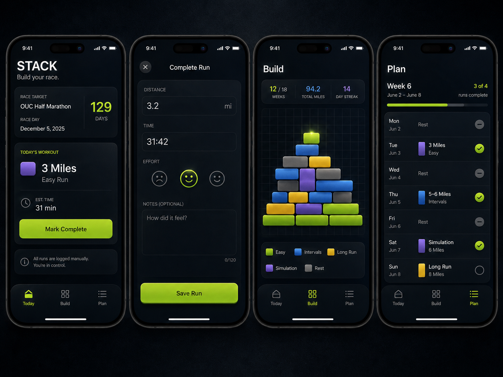

# STACK

**Build your race.**

STACK is a phone-first running app organized around the runner's actual training history, with race intent, a tactile Build system and optional Crew layered around that truth.



## Current product status

**`main` is the canonical, production product branch.**

STACK Next shipped to `main` through PR #136 on August 20, 2026. The former `feature/stack-next` integration branch and its child-branch workflow are historical development infrastructure, not the place for new work.

The product direction established by STACK Next remains active on `main`:

> **Actual history says what happened. Plan says what was intended. A link says how an actual run relates to that intent.**

The runner and the runner's actual history are foundational. Plan remains useful race-specific intent, Build remains the tangible reward, and Crew remains optional and downstream of personal truth.

## Where new work starts

Read `START_HERE.md` and `AGENTS.md` before changing code.

Normal work should:

1. start from the latest `main`;
2. use a narrowly scoped issue branch;
3. keep one coherent issue/phase per branch unless an explicit dependency requires stacking;
4. open a pull request back to `main`;
5. pass the repository's required validation before merge.

Do **not** start new work from `feature/stack-next` or target new PRs to it.

Current forward work is tracked as GitHub issues, including the **STACK 1.0 Stabilization 1.xx** and **STACK Evolution 2.xx** sequences.

## Read first

For current work, use this entry path:

```text
START_HERE.md
AGENTS.md
docs/PRODUCT_AND_SCOPE.md
docs/CURRENT_APPLICATION_STRUCTURE.md
docs/ENGINEERING_STANDARDS.md
docs/DESIGN_SYSTEM.md
```

Then read the specialist contract for the system you are touching, for example:

- `docs/CONNECTED_DATA_FIELDS.md` and `docs/INTERVALS_INTEGRATION.md` for connected running data;
- `docs/RUNS_PRODUCT_MODEL.md`, `docs/RUNS_VISUALIZATION_SYSTEM.md` and `docs/RUN_DETAIL_PRODUCT_SPEC.md` for Runs/Run Detail;
- `docs/CREW_PROJECTION_CONTRACT.md` and current Crew/security docs for Crew uploads, awards or Supabase behavior;
- `docs/DATA_AND_STORAGE.md` and `docs/PERSONAL_ACCOUNT_SYNC.md` for persistence/account sync.

`docs/STACK_NEXT.md`, `docs/STACK_NEXT_IMPLEMENTATION.md`, `docs/STACK_NEXT_AGENT_PROMPT.md` and individual NEXT/Runs phase briefs remain historical implementation records. They are useful for rationale, but they do not define the current branch workflow.

## Current application shape

At a high level, STACK includes:

- **Today** — what matters now;
- **Build** — the physical reward for runs recorded/accepted into STACK;
- **Runs** — unified actual history, current-running context, Training Signals, History and Run Detail;
- **Crew** — an optional social/shared Build destination for active Crew members;
- **Plan** — upcoming and historical race intent, explicitly separate from actual history;
- manual logging plus connected Intervals.icu data;
- personal account synchronization and local resilience;
- phone-first PWA-style behavior.

The exact current product and architecture contracts live in the current docs above; do not infer current behavior from an old phase brief when they conflict.

## Connected running-data path

The common Apple path is:

```text
Apple Watch
  ↓
Apple Health
  ↓
HealthFit
  ↓
Intervals.icu
  ↓
STACK
```

Other watches/services may connect to Intervals.icu directly. Manual logging remains a complete fallback.

`docs/CONNECTED_DATA_FIELDS.md` is authoritative for verified source fields, units and pipeline-specific semantics.

## Product boundaries

STACK is not intended to become:

- a live GPS/run tracker;
- a Strava clone;
- an Intervals.icu dashboard clone;
- a public social network;
- an AI coach that autonomously rewrites training;
- a medical/readiness product;
- a route-mapping product;
- a game economy with XP/coins/quests.

Prefer factual, traceable running context and meaningful omission over opaque scores or invented certainty.

## Technical baseline

- React
- TypeScript
- Vite
- Plain CSS/design tokens
- Lucide React
- versioned local persistence/cache
- Supabase Auth/Postgres/RLS for approved account/personal-sync and Crew systems
- Vercel deployment
- direct/proxy Intervals connection modes

Do not add a router, global-state framework, UI framework, canvas/WebGL/physics engine or broader backend merely because a feature is substantial. Add infrastructure only when the scoped issue demonstrates the need.

## Repository map

```text
/
├─ AGENTS.md
├─ START_HERE.md
├─ README.md
├─ api/            narrow serverless readers
├─ docs/           product, data, design, integration, QA and historical phase records
├─ public/         manifest and app icons
├─ scripts/
├─ seed/
├─ src/
├─ reference/
├─ supabase/       database migrations/config/tests for approved Supabase systems
└─ .github/
```

## Validation

The normal repository validation is:

```bash
npm install
npm run check
git diff --check
```

Connected-data or database changes may require additional deployed/device/SQL verification defined by their specialist contracts. Never commit real credentials, raw private payloads, GPS coordinates or other sensitive data.
